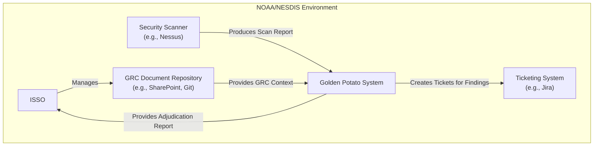
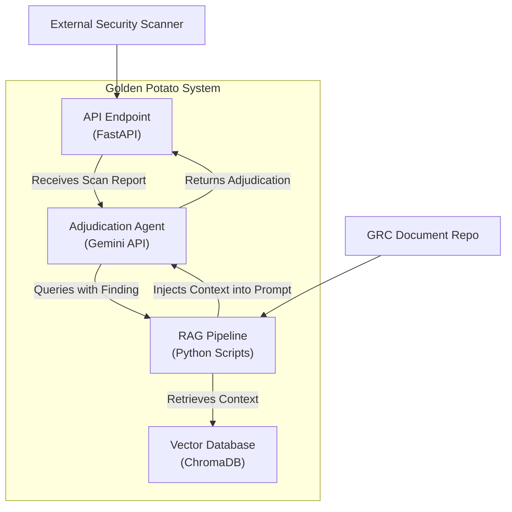

# Golden Potato - Architecture Document

This document outlines the high-level software architecture for the Golden Potato project.

## 1. Guiding Principles

*   **Automation First:** The primary goal is to automate manual GRC adjudication tasks. The architecture should prioritize straight-through processing where possible.
*   **Docs-as-Code:** GRC documentation (SSP, Exception Matrices) is the source of truth and should be treated like code—versioned and used to configure the system.
*   **Modularity:** Components (document ingestion, agent logic, reporting) should be loosely coupled to allow for independent development and replacement.
*   **Context-Awareness:** The system's core value is its ability to understand context. The architecture must be centered around providing this context to the AI agent effectively.

## 2. Architectural Approach: Retrieval-Augmented Generation (RAG)

The core of this system is a **Retrieval-Augmented Generation (RAG)** architecture. This pattern allows the Gemini Agent (the "Generator") to answer questions and make judgments based on a private, up-to-date knowledge base (the "Retrieval" component).

The workflow is as follows:
1.  **Offline Process (Indexing):** GRC documents (SSP, FIPS 200, etc.) are loaded, broken into meaningful chunks, converted into vector embeddings, and stored in a Vector Database.
2.  **Online Process (Adjudication):**
    *   A security finding is received by the agent.
    *   The agent converts the finding into a query for the Vector Database.
    *   The database returns the most relevant document chunks (e.g., the specific control implementation from the SSP, a relevant row from the exception matrix).
    *   These chunks are injected into the Gemini Agent's prompt along with the original finding.
    *   The agent uses this combined context to generate a final, justified adjudication.

## 3. System Diagrams (C4 Model)

### Level 1: System Context Diagram

This diagram shows how Golden Potato fits into the wider NOAA/NESDIS environment.

    
### Level 2: Container Diagram

This diagram breaks down the "Golden Potato System" into its major logical components.

## 4. Data Model
### Knowledge Base Data
* **Source Document:** The original file (e.g., `SSP_v1.2.pdf`).
* **Chunk:** A segment of text from the source document.
* **Embedding:** A high-dimensional vector representing the semantic meaning of the chunk.
* **Metadata:** Information attached to each chunk, such as `document_name`, `control_id`, `section_title`, etc.

### Adjudication Data
* **Input Finding:** Data from the scanner (Host IP, Vulnerability ID, Severity).
* **Output Adjudication:**
  * `status`: [Non-Compliant | Compliant (Tailored) | Not a Finding (Risk Accepted)]
  * `justification`: Text explaining the decision.
  * `evidence`: A list of the source document chunks used to make the decision.

  
